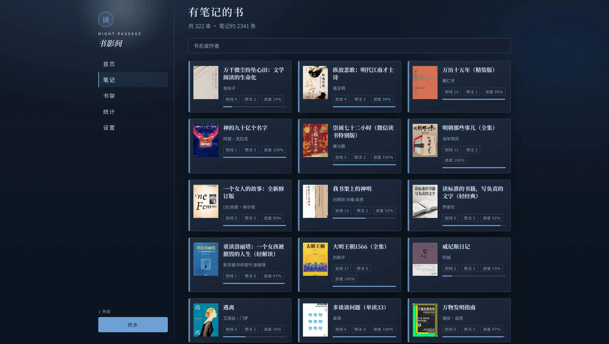
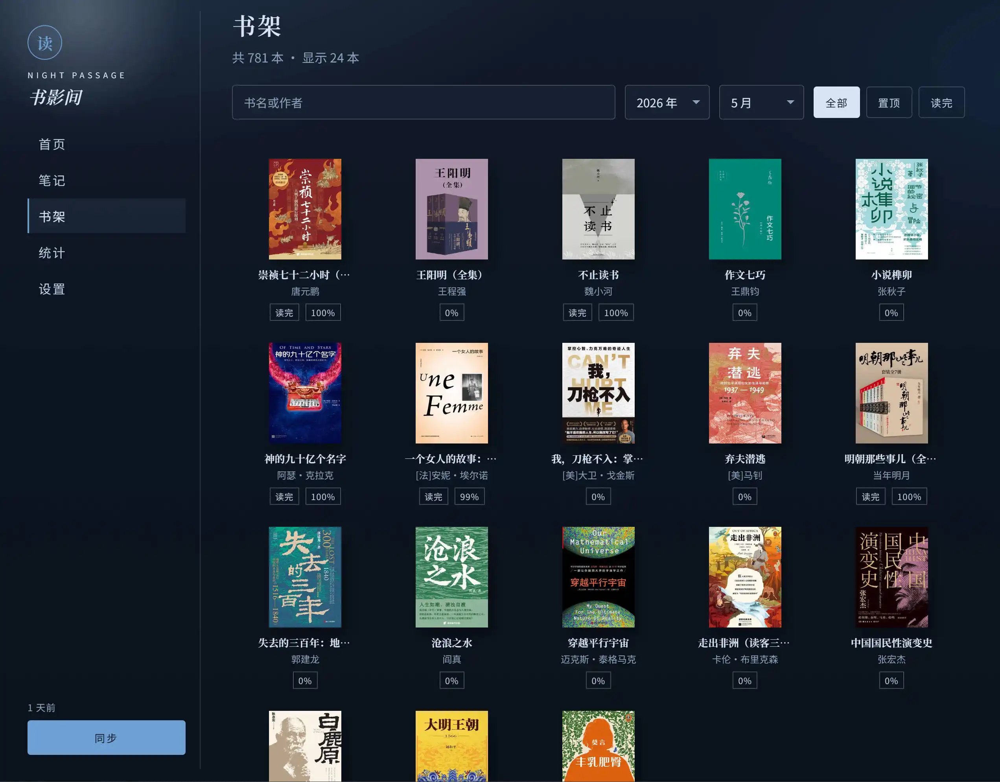
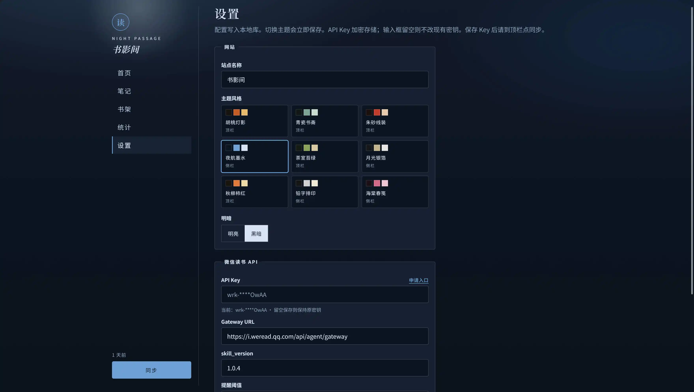
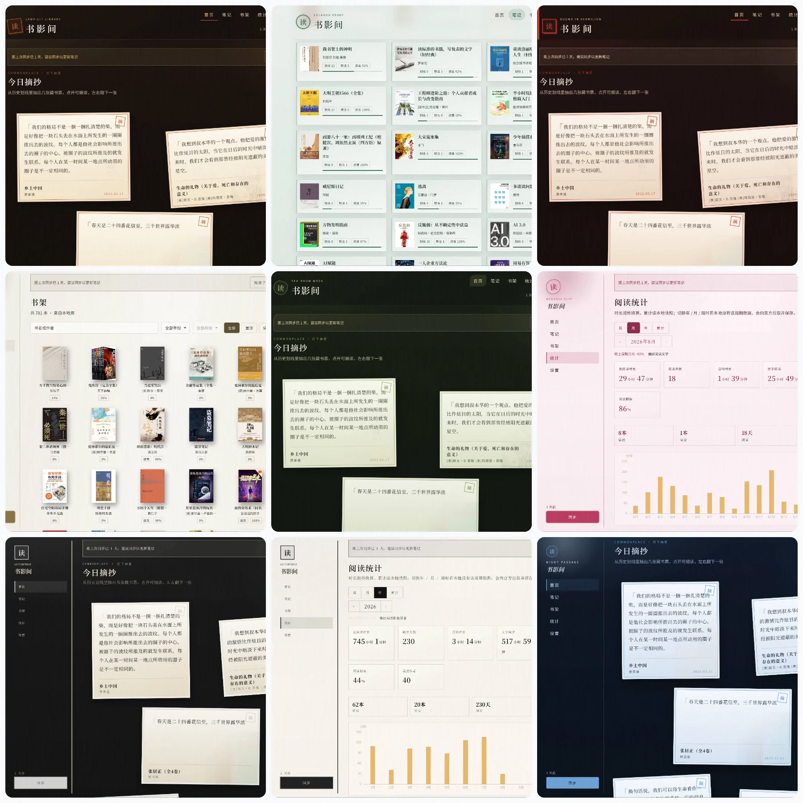

# 纸间笔记

微信读书里，划线往往停在书籍内，那些划线句子散落在各处，书架也很难按年份月份做筛选。

**纸间笔记**是个人自用的微信读书助手：把你的划线、想法、书架和阅读时长同步到本地，再用更适合回看、晒书、沉浸阅读的界面重新排版。官方 App 负责读；这里负责把读过的痕迹收成一座只属于你的小馆。

项目基于官方的[AgentSkill 项目](https://github.com/Tencent/WeChatReading)，数据走官方 [Skills API](https://weread.qq.com/r/weread-skills)，不是常规的使用登录 cookie 获取数据，不会有过期的麻烦，数据请求的是合法的官方 API（如果有疑惑也可以直接看官方的介绍）。密钥留在本机服务端，浏览器从不直连微信读书。可以本地开发、Docker 部署，也可以打成 Windows 便携桌面。

[开源地址](https://github.com/jachinq/weread_helper)

---

## 官方没有、这里有

下面四件事，是微信读书客户端里很难一次性做好、或根本没有的体验。它们也是这个项目真正想被记住的部分。

### 1. 随机笔记：每日随机抽签

首页不做信息流，做**抽签**。

每天从本地全部历史划线里抽出 5 条，排成散落的笔记卡片：原文、封面、书名、作者、划线日期。点开一张，卡片放大铺开，可左右翻阅当日这一批；从卡片也能直接进这本书的全书笔记。

同一天反复打开，默认看到的是同一批——像书桌上那几张便签，如果想换口味，点「换一批」即可重抽。

官方 App 一直没有提供方便的笔记回看功能，读得越多，在每本书里划线过的句子越难收集。纸间笔记把**「偶然重逢一句旧话」**做成首页仪式，与那些曾引起你共鸣的句子，再次相遇。

适合：早晨、睡前翻看、把一句喜欢的话截出来分享。

### 2. 完整笔记列表：按书、按章，划线与想法并排

微信读书的笔记入口偏「当前在读」和单本上下文。纸间笔记把**所有有笔记的书**收成一张可检索的书单。

- 封面、书名、作者、划线数、想法数、阅读进度一目了然
- 按书名或作者即时筛选
- 点进一本书：按章节分组；划线原文与对应想法贴在一起，独立想法单独成块
- 侧栏目录可跳章；封面可展开书籍信息卡片

这是「完整」的含义：不是某一本的摘录导出，而是整座笔记库可浏览、可检索、可按章重读。划线不再只活在阅读器的高亮层里，而成为可以慢慢逛的文本。

适合：写读书笔记前的回看、找某句出处、把一本书的想法从头到尾读一遍。

### 3. 书架按阅读时间筛选：晒出某年某月读过 / 读完的书

官方书架很难回答一个很具体的问题：**这一年、这一个月，我到底摊开过哪些书？哪些读完了？**（其实有入口，不过比较隐蔽，导致很少使用）

纸间笔记的书架按最近阅读时间排列，并提供：

| 筛选 | 用途 |
|------|------|
| 年份 | 只看某一年动过的书 |
| 月份 | 选定年份后再收窄到某月 |
| 读完 | 只留下 `读完` 标记的书 |
| 置顶 | 只看置顶 |
| 书名 / 作者 | 在当前时间范围内再搜 |

年份选项来自书架上真实出现过的阅读时间，不会列出空年。选「2024 年 + 读完」，就是一份现成的年度读完墙；选某月，就是那个月的在读足迹。截一张书架网格，就是年终晒书、读书会分享、个人主页配图。

### 4. 主题切换：支持九种风格

纸间笔记提供了九套主题，每套都有明亮 / 黑暗两种模式选择，总有一种风格适合你~

| 主题 | 气质 | 布局 |
|------|------|------|
| 胡桃灯影 | 暖木、灯火，默认馆藏 | 顶栏 |
| 青瓷书斋 | 冷绿釉色，安静 | 顶栏 |
| 朱砂线装 | 朱红线口，旧装帧 | 顶栏 |
| 夜航墨水 | 深夜航行，侧栏书架 | 侧栏 |
| 茶室苔绿 | 茶席与青苔 | 顶栏 |
| 月光银箔 | 冷银与衬纸 | 侧栏 |
| 铅字排印 | 等宽、印厂、纸边 | 侧栏 |
| 秋柳柿红 | 秋色、柿子、暖边 | 顶栏 |
| 海棠春笺 | 笺纸与海棠 | 侧栏 |

部分主题带一盏装饰灯；顶栏与侧栏两种壳，导航位置不同，同一套笔记换一种风格。应用名称也可自定义，从默认的「纸间笔记」改为任意你喜欢的名字。

---

## 这里还有什么

特色之外，同步进来的数据同样能用。

**阅读统计**

周 / 月 / 年 / 累计切换。历史年、月、周可步进；本地没有该周期快照时，按需向官方拉取并入库，不覆盖其它周期。总时长、阅读天数、日均；有每日时长则画分钟柱状图；有分类偏好则展示标签。时长按秒换算，页面上直接读小时与分钟。

**只读本地，手动同步**

笔记、书架、统计数据都会有本地数据快照。同步只由你手动触发：增量刷新有笔记的书（计数、进度变化才拉章节与划线），书架整份覆盖。设置里的间隔只是「该提醒了」的阈值，进程不会自己半夜去打官方接口。

**密钥不出浏览器** 

API Key 用 AES-256-GCM 加密进库；页面只显示脱敏形态。

---

## 适合谁

重度微信读书用户、又嫌官方笔记管理不适合「展览」的人。

读过的书，合上后就再也不会翻开了？那些曾经让你思考的过的句子，也不再会看到了？那么「纸间笔记」将会很适合你，与那些划线过、思考过的句子，再次重逢吧~

## 怎么用

支持 windows系统、或者 docker 部署，看仓库说明。

Windows系统使用步骤：

第一步：下载压缩包，解压后直接双击 `weread-helper-desktop.exe` 启动。也支持开机自启动（在系统托盘中开启）。

第二步：去官网准备好 [微信读书 Skills API Key](https://weread.qq.com/r/weread-skills)，填进对应设置项，保存后，点一次「同步」按钮，今日摘抄即刻送达。

